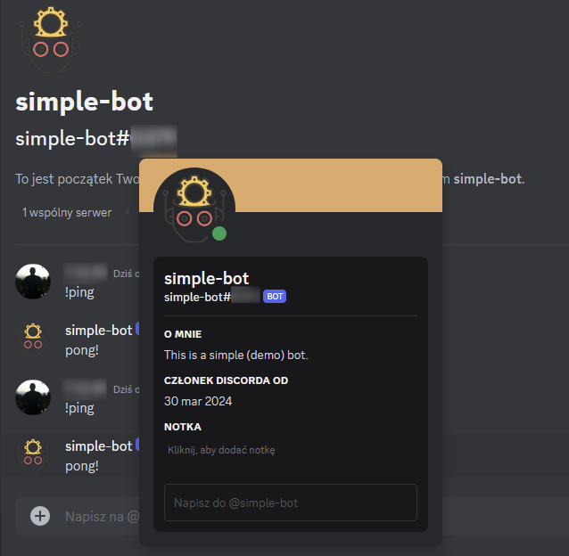

# Discord Bot

This is a simple [Discord](https://discord.com/) bot.

- [Discord Bot](#discord-bot)
  - [Features](#features)
  - [Technologies](#technologies)
  - [Setup](#setup)
    - [Usage](#usage)

## Features

The bot can be used to automate tasks in a Discord server. It can be used to:

- as of now, respond to the ping message:

## Technologies

The application is built using the following technologies, libraries, frameworks, and tools:

- [Go](https://golang.org/),
- [godotenv](https://github.com/joho/godotenv),
- [DiscordGo](https://github.com/bwmarrin/discordgo).

## Setup

Before running the application, you need to create a `.env` file in the root directory of the project with the following content:

```env
DISCORD_BOT_TOKEN=PUT_YOUR_DISCORD_BOT_TOKEN_HERE
```

Or set the environment variables directly in your environment.

To get the `DISCORD_BOT_TOKEN`, please read [this guide](https://www.writebots.com/discord-bot-token/).

To run this application:

```bash
go build . && ./08_discord_bot
```

If you want to add some extra dependencies to the project, you might need to run the following command (as we are using Go modules and vendoring) afterward:

```bash
go mod tidy && go mod vendor
```

Given that you've set up Discord properly, you should be able to interact with the bot in a Discord server.

In my case, I've created a bot called `simple-bot`, and I can interact with it by mentioning it in a message.

### Usage

To use the bot, please send it a message `!ping`. For example:

```text
@simple-bot !ping
```

The bot should respond with `pong!`.


